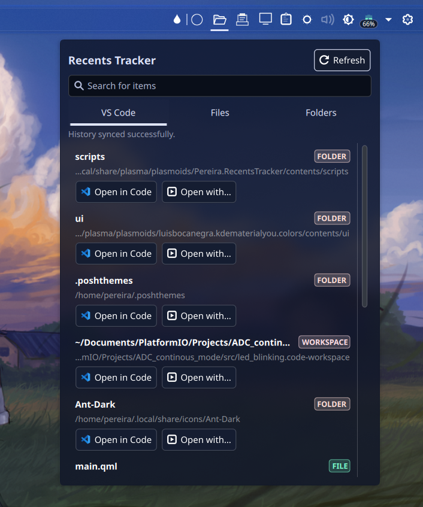
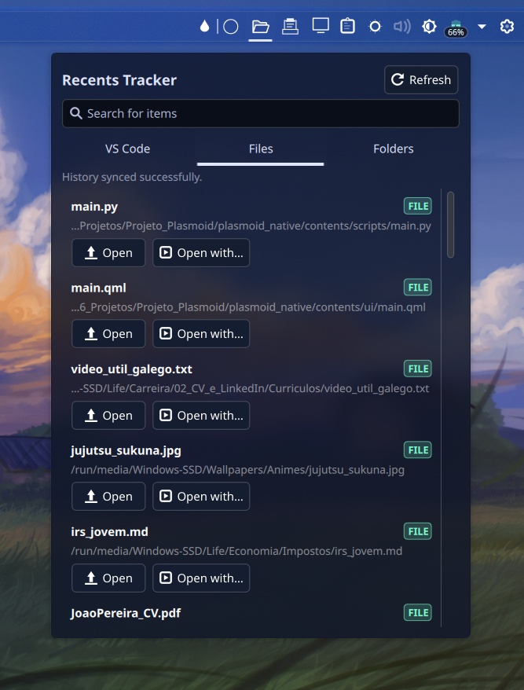
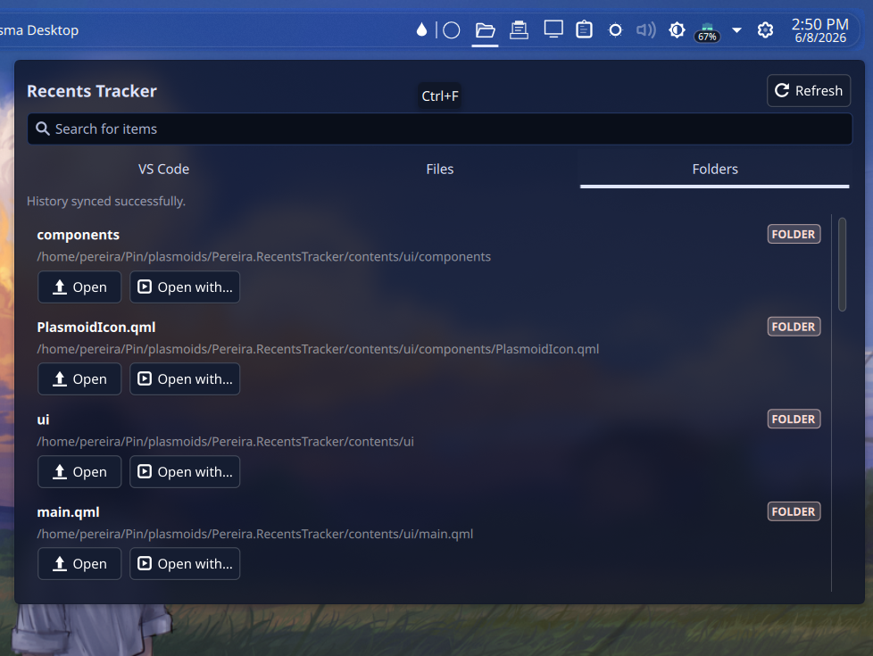
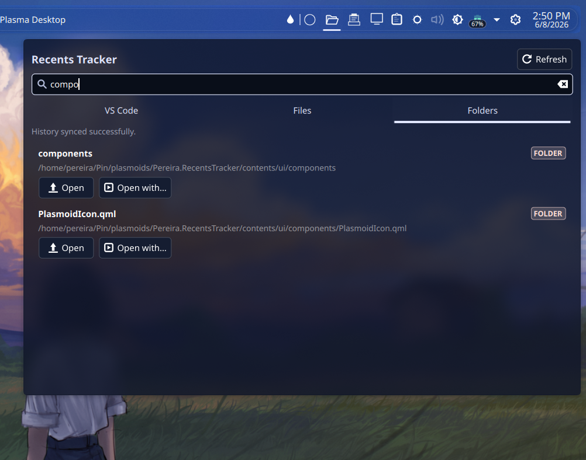

# Plasma Recents

Plasma Recents is a KDE Plasma 6 widget that provides quick access to recently opened files, folders, workspaces, images, videos, and other items from your desktop. It brings recent items from KDE and VS Code-based editors into a single, fast, and convenient interface.

## Features

📁 **Recent Files & Folders**  
Show recently opened files and directories in a simple KDE Plasma widget.

💻 **VS Code Integration**  
Track recent files, folders, and workspaces from VS Code and compatible variants such as Code - OSS and VSCodium.

🔎 **Fuzzy Search**  
Quickly find items within each recent-items tab.

📂 **Open With**  
Open an item with the default system handler or choose another application from the "Open With" menu.

⭐ **Favorites**  
Pin frequently used files, folders, or workspaces so they remain easily accessible.

📋 **Copy Path**  
Quickly copy the full path of an item.

🖱️ **Double-click**  
Double-click an item to open it with the default system handler.

⚙️ **Configurable**  
Configure options such as the VS Code database path and the number of displayed items.

## Screenshots

<table>
  <tr>
    <td align="center">
      
    </td>
    <td align="center">
      
    </td>
  </tr>
  <tr>
    <td align="center">
      
    </td>
    <td align="center">
      
    </td>
  </tr>
</table>

## Use Cases

This plasmoid is designed to make recently opened files and projects easier to find and access directly from your KDE Plasma desktop.

Have you ever opened your file manager, navigated through several directories to find a file, opened it, and then accidentally closed the window without remembering where it was? Instead of navigating through those directories again, simply refresh the plasmoid and the file will appear in your recent items.

The same idea applies to VS Code. Although VS Code already provides a list of recently opened files and projects, this plasmoid provides a faster and more convenient way to access them. It makes it easier to identify the project or file you are looking for and lets you perform actions without opening VS Code first. You can, for example, copy the path, open the project directly in a terminal, or use it for tasks such as running Git commands or cleaning up files.

It is also useful for images, screenshots, videos, and other files that you may open temporarily and then lose track of. If you opened an image and forgot where it was stored, the plasmoid provides a quick way to find it again.

In short, the plasmoid is useful whenever you think:

> "I just opened that file, but where was it?"

## Supported Sources

The plasmoid collects recently opened items from different sources depending on the application.

### VS Code and VS Code-based editors

For VS Code and compatible variants, the plasmoid reads the editor's `.vscdb` database. This is a **SQLite database** used by VS Code to store internal state and information about workspaces, files, and other editor data.

The database contains different types of stored values, including **JSON and binary data**. The plasmoid reads the relevant entries from the database to retrieve recently opened files, folders, and workspaces without having to launch the editor.

### Other applications

For other applications, the plasmoid uses **XBEL** (`.xbel`), an XML-based format used by KDE to keep track of recently accessed files and locations.

The plasmoid reads the relevant entries from the XBEL history and converts them into the same recent-item format used by the widget.

This allows the plasmoid to provide a unified list of recently opened files, folders, projects, images, videos, and other items across different applications.

## Target Audience

This plasmoid is primarily aimed at **KDE Plasma beginners** who want a simple and convenient way to keep track of recently opened files and projects.

It is intended to make the KDE experience more complete and approachable by providing quick access to recently used content directly from the desktop, without requiring users to navigate through their file system or open another application just to find something they recently used.

At the same time, it can also be useful for experienced KDE users who want a faster workflow and quick actions such as copying paths, opening files in a terminal, or launching them with a specific application.

The goal is simple: **make finding and accessing recently used files faster, easier, and more convenient, while making the KDE Plasma experience even better.**

## Compatibility

Compatible with KDE Plasma 6.

The widget currently focuses on Linux and KDE Plasma environments.

## Dependencies

Plasma Recents is designed for KDE Plasma 6 and has no additional third-party dependencies.

The following components are required:

* **KDE Plasma 6** — required to run the plasmoid.
* **Python 3** — required by the helper scripts used for VS Code integration.
* **kpackagetool6** — used by the installer to install and update the plasmoid package.

## Installation

Clone the repository and run the installation script:

```bash
git clone https://github.com/joao2pereira1/plasma-recents.git
cd plasma-recents
```

Before running the installer for the first time, make sure the script has permission to execute:

```bash
chmod +x installer.sh
```

Then run the installation script:

```bash
./installer.sh
```

The installer automatically installs the plasmoid using `kpackagetool6`.

The installer automatically uses kpackagetool6 to install the plasmoid package. If kpackagetool6 is not available on your system, the installer will attempt to install it automatically.

However, it is recommended to install kpackagetool6 manually beforehand to ensure that the required KDE package management tool is available:

```bash
# Ubuntu / Debian
sudo apt install kpackagetool6

# Arch Linux
sudo pacman -S kpackagetool6

# Fedora
sudo dnf install kf6-kpackage
```

> **Note:** Package names may vary slightly depending on the distribution version and KDE Plasma packages available in your repositories. The installer will also attempt to install kpackagetool6 automatically if it is not found.

Once the installation is complete, open the KDE Plasma widget explorer and add **Plasma Recents** to your desktop or panel.

> **Note:** Plasma Recents is currently under development. An official release through the **KDE Store** is planned for the future.

## Configuration

The widget uses separate JSON files for persistent data:

```text
config.json
├── max_items
├── page_size
├── show_missing_files
├── vscode_db_path
├── excluded_directories
├── show_vscode_tab
└── ...

apps.json
└── Applications available in "Open With"

history.json
├── App usage
├── Favorites
└── Frecency data
```

The configuration format is still being developed and may change before the first stable release.

## Project Status

Plasma Recents is currently under active development.

There are many features incoming.

The project structure and configuration format may change before the first stable release.

## License

This project is licensed under the GNU General Public License v3.0.

See the `LICENSE` file for details.
